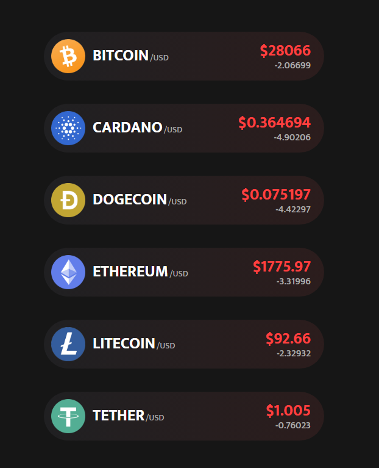

<div align='center'>

</div>

<p align="center">
  

  
  
  <a href="https://github.com/ArthurB95/CryptoPrice/commits/master">
    
  </a>
    
</p>

<h4 align="center"> 
	🚧  CryptoPrice  ♻️ Finished 🚀 🚧
</h4>

## 💻 About the project

👨‍💻 CryptoPrice - The intention of this project is to show the price in USD of the main current cryptocurrencies (Bitcoin, Cardano, Dogecoin, Ethereum, Litecoin, Tether)

---

## ⚙️ Functionalities

-   [x] It is possible to see the real prices of current cryptocurrencies.

---

## 🚀 How to run the project

```bash

# If you want to clone the repository just use the command:
$ git clone https://github.com/ArthurB95/CryptoPrice.git

```

---

## 🛠 Technologies

The technology used for this application was:

-   **HTML**
-   **CSS**
-   **JS**
-   **The api used was from the CoinGecko website: [CoinGecko](https://www.coingecko.com/pt/api/documentation])**

---

## 💪 Thanks

-   This project was made thanks to the channel **[AsmrProg](https://www.youtube.com/@AsmrProg/videos)**. Access the channel and support the created.
